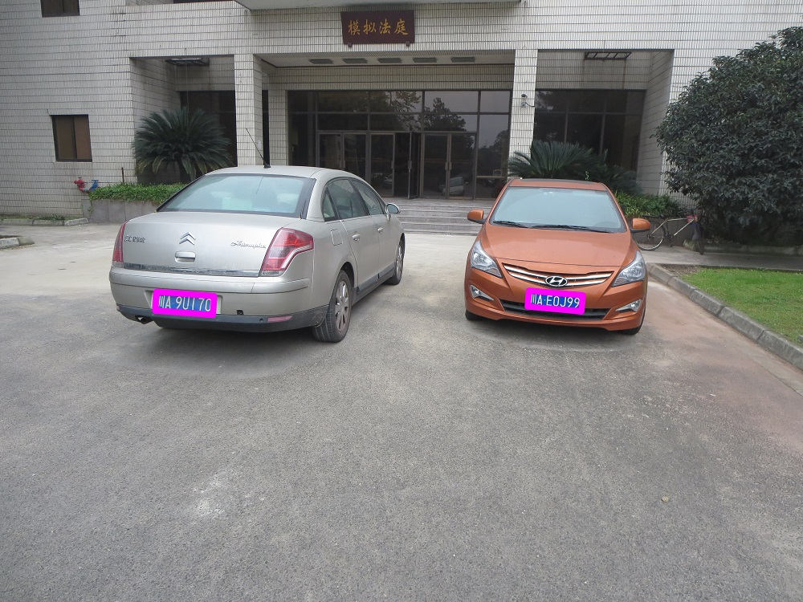

## 车牌定位

### 特点：
1. 对于canon和iPhone等数据集有较好的检测效果，精度分别达到100%与95%
1. 可以识别出一张图片中的多个车牌
1. 使用旋转的粉色矩形框精确标记，方便截取出车牌区域做进一步空间变换
1. 综合使用颜色空间变换、滤波、形态学变换、模式识别等方法
1. 基于OpenCV-Python

### 需要改进:
1. 由于基本筛选为基于色彩分量的阈值法筛选，且实验数据为白天拍摄，因此对夜间拍摄的低质量图像识别效果较差，需要进一步优化，在同样参数下，hp数据集几乎无法识别
1. 与车牌相同颜色的车辆难以准确识别，理论上可通过在边缘检测的基础上进一步提取特征，暂时还未实现

### 说明
+ finish目录下为定位标识后的图像
+ 其他文件夹下为相应数据集